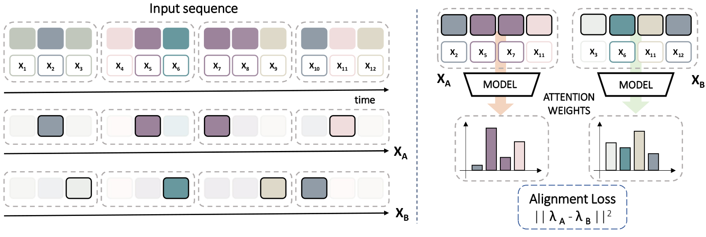

# Consistency-based Self-Supervised Learning for Temporal Anomaly Localization
This repository contains Pytorch code for the [WCPA ECCV22](https://sites.google.com/view/wcpa2022/) paper "Consistency-based Self-Supervised Learning for Temporal Anomaly Localization" [[arXiv](https://arxiv.org/abs/2208.05251)]



```bibtex
@inproceedings{panarello2022consistency,
    title = {Consistency-based Self-supervised Learning for Temporal Anomaly Localization},
    author = {Panariello, Aniello and Porrello, Angelo and Calderara, Simone and Cucchiara, Rita},
    booktitle = {Proceedings of the European Conference on Computer Vision (ECCV) Workshops},
    month = {October},
    year = {2022},
}
```

## Installation Note

Tested with Python 3.8.13 on Ubuntu (22.04).

- Setup an empty pip environment
- Install packages using ``pip install -r requirements.txt``
- Place dataset in ``./data/`` [Download Link](https://stuxidianeducn-my.sharepoint.com/:u:/g/personal/pengwu_stu_xidian_edu_cn/EYcpIgLj2TxKhlPlWcfjsZ4Bbe5tz7AbqH_eP3ZzM6Ul-Q?e=yRpwqq)
- Run main.py

Please note that if you're running the code from Pycharm (or another IDE) you may need to manually set the working path to ``PROJECT_PATH``

Run ``python main.py`` to train the model.

## Improvements over the original paper

- [x] Add support for gated attention [1] leading to a +3% improvement in AP frame-level.

---
## References
[1] Ilse, Maximilian and Tomczak, Jakub and Welling, Max. Attention-based deep multiple instance learning. International conference on machine learning. PMLR, 2018.
